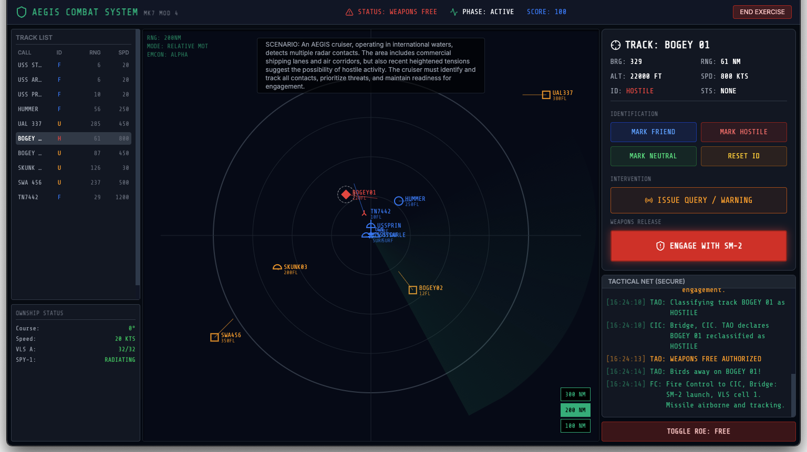

# Aegis Sim

<div align="center">
  
</div>

<br />

<div align="center">
  <a href="https://aegis-sim.obliscence.com">
    
  </a>
</div>

<br />

## Vibecoded

This project was **vibecoded** using advanced AI models:
-   **90%** Gemini 3 Pro
-   **10%** Claude 3.5 Sonnet

## Powered by Gemini

The simulation calls out to **Gemini 2.5 Flash** to generate a unique, tactical scenario every time you play. No two engagements are exactly alike.

## Run Locally

### Prerequisites

-   Node.js
-   pnpm (recommended) or npm

### Steps

1.  **Install dependencies:**
    ```bash
    pnpm install
    ```

2.  **Configure Environment:**
    Set the `GEMINI_API_KEY` in `.env.local` to your Gemini API key.

3.  **Run the app:**
    ```bash
    pnpm dev
    ```

## Deploy with Docker

1.  **Build the Docker image:**
    ```bash
    docker build -t aegis-sim:latest .
    ```

2.  **Run the container:**
    ```bash
    docker run -p 8080:80 -e GEMINI_API_KEY=your_api_key_here aegis-sim:latest
    ```

3.  **Access the app:**
    Open `http://localhost:8080` in your browser.
